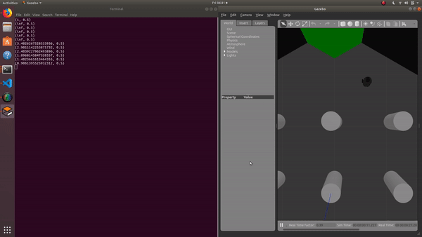

# COSI 119A Repository Jacob Smith Fall 2019

### Contains my homework for the course and serves as a backup

### Homework 4.2 ROSSUMMARY

#### 	**Overview**

###### 		4.1Script: A bash file that automatically launches ROSCORE, gazebo, and all of my python classes

###### 		action_server.py: This ROS Action receives a request to turn the robot by a certain amount and 	 				publishes a Twist message to move the robot.

###### 		console_node.py: This ROS node prompts the user to enter console input and publishes the 			input to a topic

###### 		fake_nlp.py: This ROS service parses user entered commands into an amount to turn the robot. 				If the command does not translate to an amount to turn, it prints an error message and 					turns 0

###### 		main_node.py: This ROS node handles communication with the other ROS objects and with 					gazebo. It subscribes to the console node, passes the command to the fake_nlp service, 					and requests the action server to move the robot

### Other Code

​	The only code I used not included here are these convenience lines which let me create a shortcut to run 	the 4.1Script file

	Type: code ~/.bashrc#	
	add Path so I don't have to type Bash and start at that directory Jacob Smith 		9/11/2019`
	`curDir='/home/robotics/Documents/Homework4.2/catkin_ws/src/rossummary/scripts'export PATH="$PATH:"$curDircd $curDir``
### Note

​		I used the class prrexamples as a template for the package and node/service/action layout of this 			assignment. I also searched the internet for solutions to errors and problems I was having, see links 			below.

#### Useful Links for Original ROSSUMMARY Homework

Looping in bash script :

​	https://www.cyberciti.biz/faq/bash-loop-over-file/ 
Allow git merging: 

​	https://stackoverflow.com/questions/37937984/git-refusing-to-merge-unrelated-histories-on-rebase 
Get current directory: 

​	https://www.rapidtables.com/code/linux/linux-current-directory.html
Open new terminal window:

​	https://unix.stackexchange.com/questions/373186/ 
Kill terminal windows by name:

​	 https://stackoverflow.com/questions/160924/how-can-i-kill-a-process-by-na	 
Copy files from one location to another:

​	https://stackoverflow.com/questions/14371039/copy-all-files-in-a-directory-with-a-particular-string-in-the-filename-to-differ

 Avoid typing bash to run a script
 	https://stackabuse.com/how-to-permanently-set-path-in-linux/

Start bash to run in correct directory

​	https://askubuntu.com/questions/332062/setting-default-path-when-opening-a-terminal-session

Store path in bash variable

​	https://stackoverflow.com/questions/8950695/shell-scripting-using-a-variable-to-define-a-path

Adding variable to string

​	http://www.compciv.org/topics/bash/variables-and-substitution/

Doing arithmetic with variable

​	https://unix.stackexchange.com/questions/55069/how-to-add-arithmetic-variables-in-a-script

Set window of new terminal

​	https://unix.stackexchange.com/questions/48984/how-can-i-set-the-position-that-terminal-opens-at

`Set default path`

	https://askubuntu.com/questions/332062/setting-default-path-when-opening-a-terminal-session
	 	https://stackabuse.com/how-to-permanently-set-path-in-linux

Check if String represents an integer

​	https://stackoverflow.com/questions/1265665/how-can-i-check-if-a-string-represents-an-int-without-using-try-except

Convert String to int

​	https://guide.freecodecamp.org/python/how-to-convert-strings-into-integers-in-python/

Set Robot Type in Gazebo NathanelGandi, set MODEL to burger instead of whatthey where doing

​	https://github.com/turtlebot/turtlebot/issues/236

Launch Gazbo 20:21 in video:

​	https://www.youtube.com/watch?v=9U6GDonGFHw

### Links for Automatic Robot Log in

shutdown ros https://answers.ros.org/question/242098/how-to-shutdown-all-nodes/

publish cmd_vel https://answers.ros.org/question/218818/how-to-publish-a-ros-msg-on-linux-terminal/

escape characters in bash https://linuxhint.com/bash_escape_quotes/

expect command to automate ssh login, I didn't get to work https://www.linuxquestions.org/questions/linux-general-1/automatically-passing-an-answer-to-a-command%27s-prompt-918926/

ssh pass aut log in https://www.cyberciti.biz/faq/noninteractive-shell-script-ssh-password-provider/

agreeing to command line liscence https://askubuntu.com/questions/78235/how-do-i-accept-an-agreement-in-terminal

sending remote command to terminal (Edward Torvalds Answer) https://unix.stackexchange.com/questions/261531/how-to-send-output-from-one-terminal-to-another-without-making-any-new-pipe-or-f

get terminal number https://unix.stackexchange.com/questions/261531/how-to-send-output-from-one-terminal-to-another-without-making-any-new-pipe-or-f

store command output in variable https://askubuntu.com/questions/323162/how-do-i-assign-the-output-of-a-command-to-a-variable

parse a string https://unix.stackexchange.com/questions/312280/split-string-by-delimiter-and-get-n-th-element

send terminals to each other https://unix.stackexchange.com/questions/135108/sending-message-from-one-terminal-user-to-another-user/135111

## Homework ROS ROOMBA

#### **Overview**

###### runRoomba.sh: A bash file that automatically launches ROSCORE, gazebo, and the runRoomba node

runRoomba.py: A python ROS node (based on wander.py) which drives forward if it does not see a ditacen less than the threshold, and turns if it does. This behavior results in a wall avoiding pattern, much like a roomba.

To Do: widen robot's field of vision, have it turn random amount so it doesn't drive in loops, run on real robot, lengthen time until robot gets stuck

​	Demonstration: This is my roomba program running on the gazebo simulator, it gets stuck after the video 	ends.

**-Jacob Smith** jsmith2021@brandeis.edu